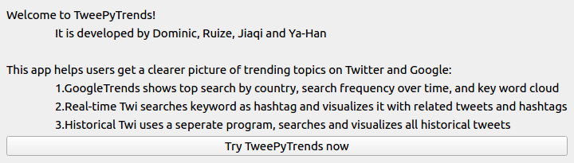
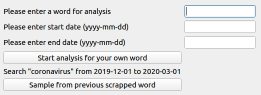
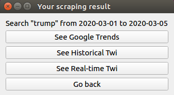
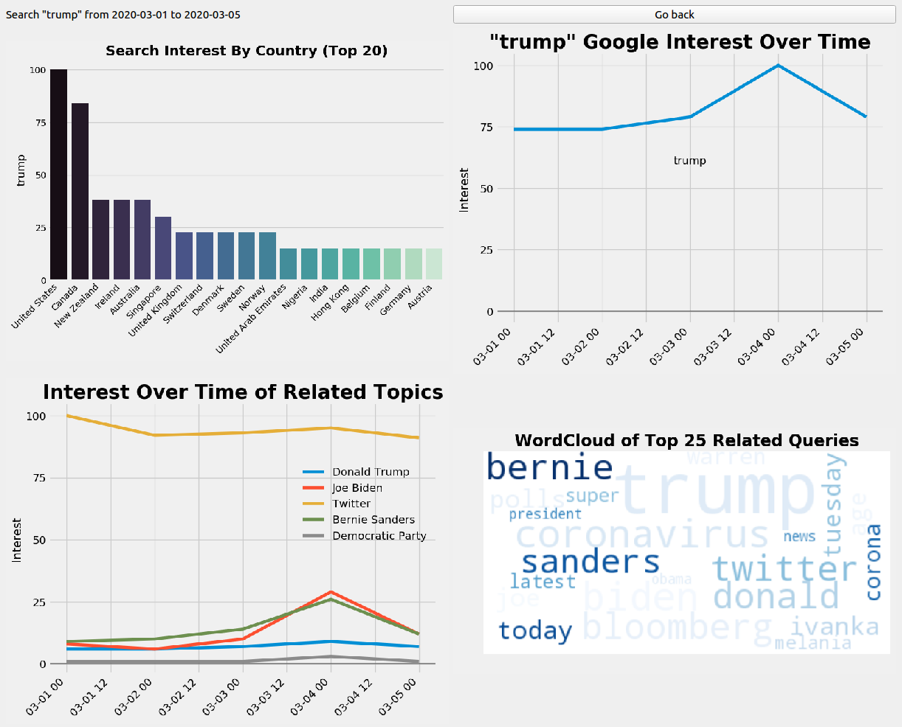
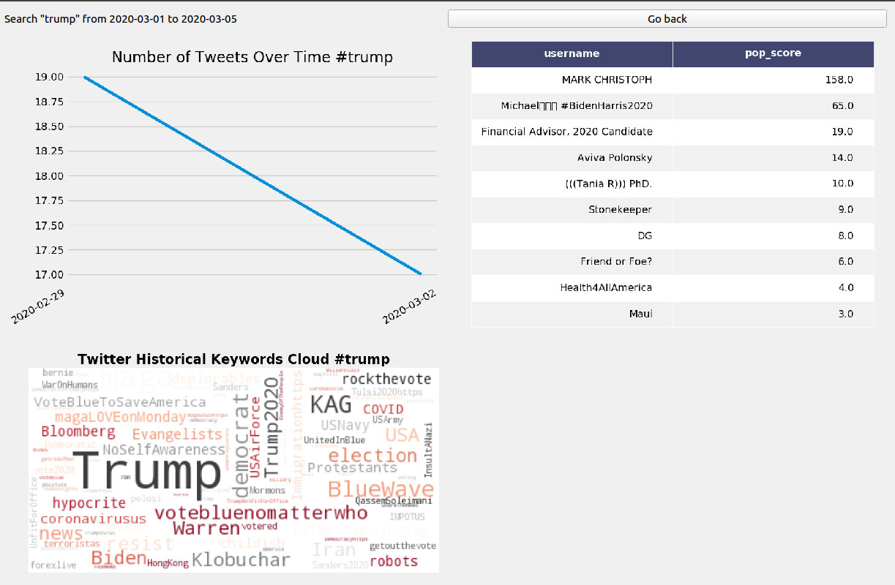
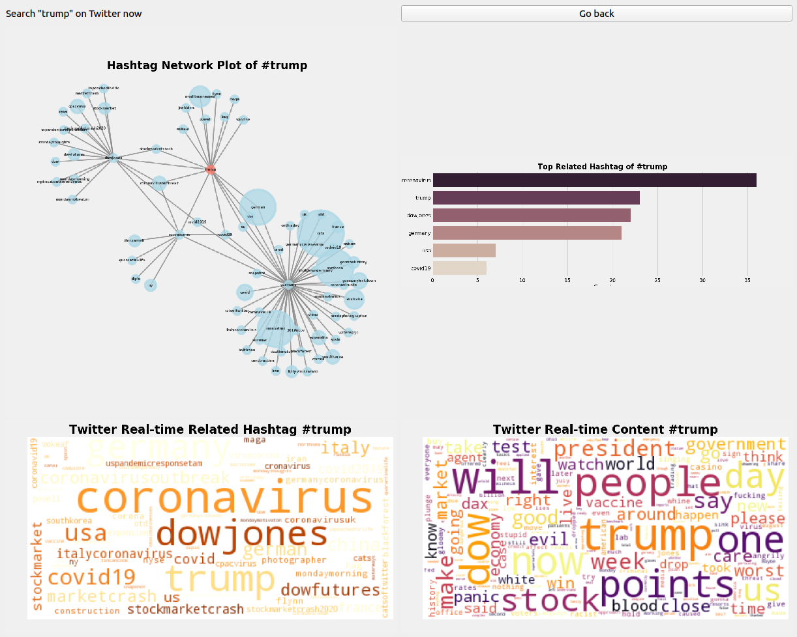

# TweePyTrends

This TweePyTrends project is developed by Dominic, Ruize, Jiaqi, and Ya-han as our capstone group project for the graduate level course CAPP30122.

## Introduction

The goal of this project is to see how people on Twitter interact with a certain topic (e.g: Black Lives Matter; Me Too or Corona Virus) then compare it with Google search trends to get a more complete picture on the topic. We show how users' sentiment on Twitter and Google search trends through several visualisations including interest of topic over time; related words; who are the key opinion leaders, etc.  

## Structure

Users are required to have a Search Term input that is comprised of a single word. Users are also required to have search date parameters of start date and end date.

In this project, we use three data collection models/packages:

1. `GoogleTrends.py` (API): retrieves data from Google Trends. The file will then create visualizations (search interest over time; 20 countries with the highest search interest, etc)  based on the data. 

2.  `tw_scrapper.py` (API): retrieves data from all historical tweets (works significantly slow). Our `tw_plot.py` file will then create visualisations (word cloud; frequency chart and top 10 key opinion leaders) based on the date. 

3.  `crawler.py`  (real-time Web scrapping): scraps real-time data from twitter based on hashtags. We will similarly create visualisations such as word cloud; network plot, etc. 

Finally, we have also created a User Interface function  `GUI.py` which allows the user to see a previously created example of 
Search Term: coronavirus
Start/End Date: 2020-02-01, 2020-03-05


## Usage

After installing all packages (as requirements.txt), run
```command
python3 GUI.py
```
To retrieve historical Tweets, run below before entering in the app
```command
python3 go2.py word start_date end_date
```


## UI Page Details

#### 1. Welcome Page 



#### 2. Input Page 



#### 3. Data Source Page 



#### 4. Google Trends Page  



#### 5. Historical Tweets Page 



#### 6. Real-time Tweets Page 



## Requirements and Versions

Please check [here](Files/requirements.txt) for the necessary Python requirements. 

## Video Demo

[Video Demo](https://drive.google.com/file/d/1jU-BqtF_r2aM-snOW0pBP6H-jinOm8nu/view
) produced by Laura.
 
